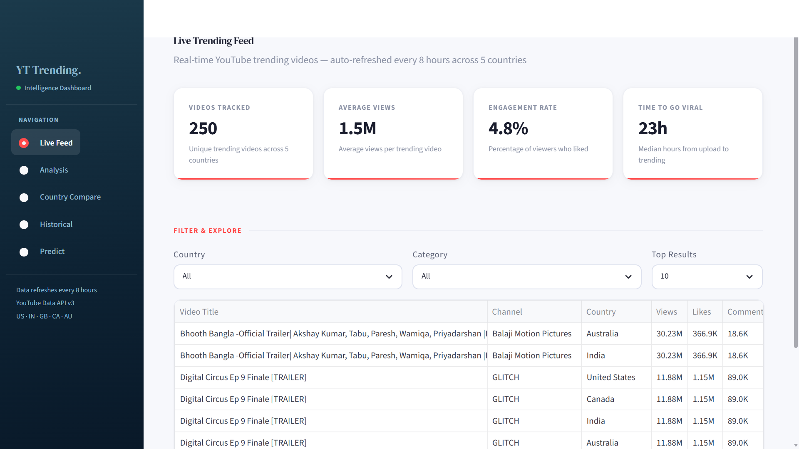
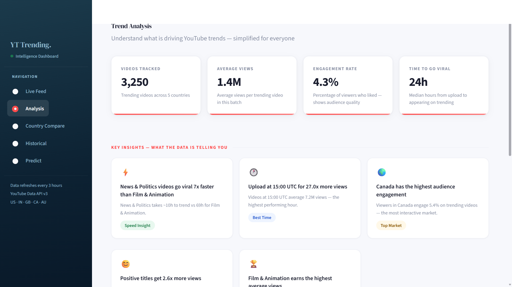
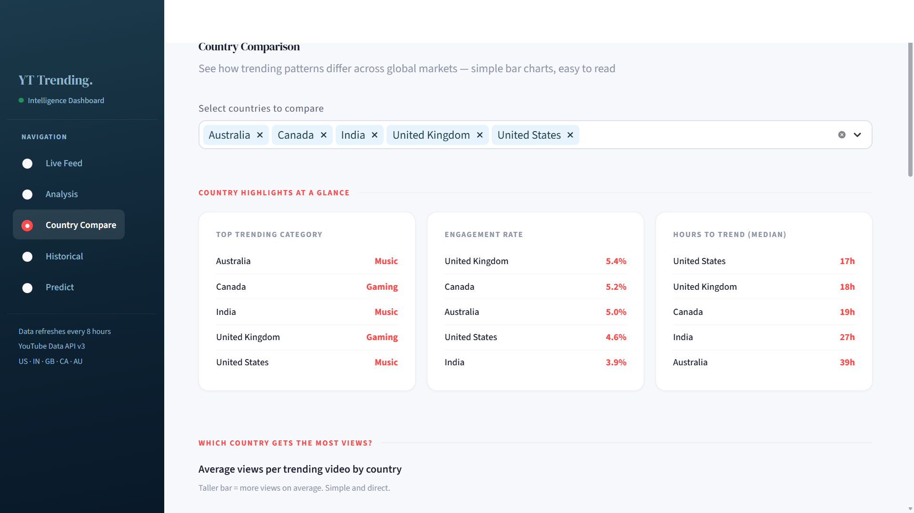
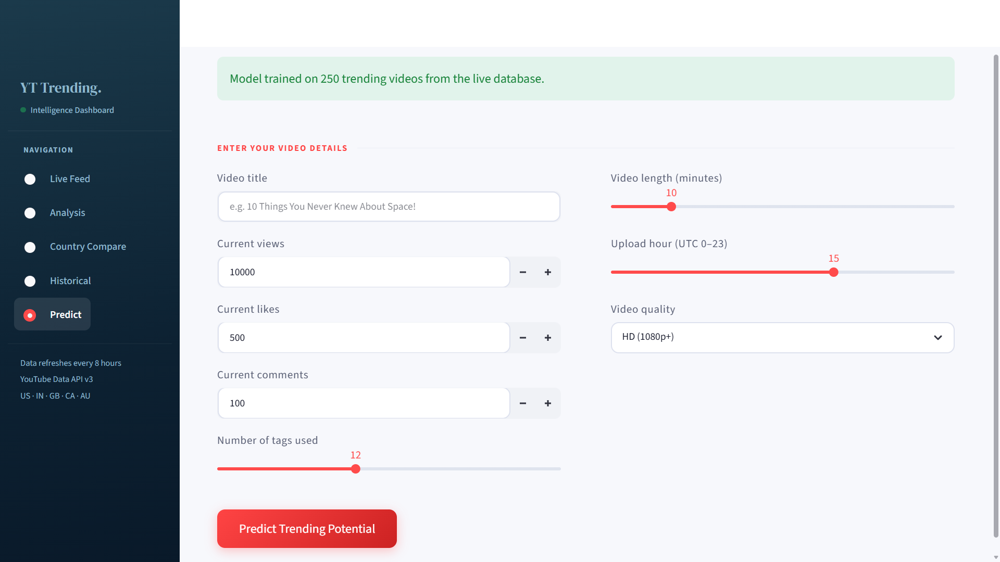
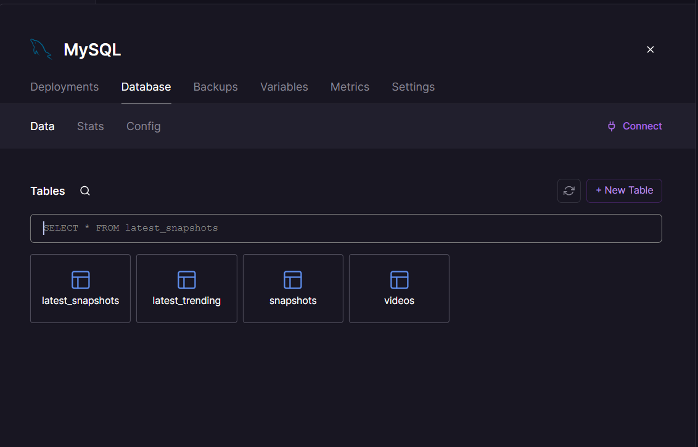

# YT Trending Intelligence Dashboard
 
> A fully automated, cloud-deployed data science system that collects YouTube trending videos from 5 countries every 3 hours — even when your laptop is completely off.
 
[](https://github.com/ashishkumar2005/yt/actions)
[](https://yt-production-8742.up.railway.app)
[](https://python.org)
[](https://mysql.com)
 
---
 
## Live Demo
 
**Dashboard:** [yt-production-8742.up.railway.app](https://yt-production-8742.up.railway.app)
 
---
 
## Screenshots
 
| Live Feed | Analysis |
|-----------|----------|
|  |  |

| Country Compare | Predict |
|-----------------|---------|
|  |  |

### Database

 
---
 
## What This Project Does
 
Think of it like **a newspaper that writes itself.**
 
Every 3 hours, an automated pipeline:
1. **Wakes up** on GitHub Actions (no laptop needed)
2. **Calls YouTube API** → fetches top 50 trending videos from 5 countries
3. **Saves 250 videos** into a cloud MySQL database on Railway
4. **Dashboard updates** automatically — anyone can visit the live URL
 
```
Every 3 hours (GitHub Actions)
        ↓
YouTube Data API v3
        ↓
250 videos (US · IN · GB · CA · AU)
        ↓
Railway MySQL Database
        ↓
Live Streamlit Dashboard
        ↓
yt-production-8742.up.railway.app
```
 
---
 
## Architecture
 
```
┌─────────────────────────────────────────┐
│              GITHUB ACTIONS             │
│   Cron: every 3 hours (0 */3 * * *)    │
│   → Installs dependencies               │
│   → Runs src/data_collector.py          │
│   → Fetches 250 videos from YouTube     │
│   → Saves to MySQL                      │
└────────────────────┬────────────────────┘
                     │ inserts data
                     ↓
┌─────────────────────────────────────────┐
│                RAILWAY                  │
│  ┌──────────────┐  ┌─────────────────┐  │
│  │  MySQL DB    │  │ Streamlit App   │  │
│  │  videos      │◄─│ dashboard/      │  │
│  │  snapshots   │  │ app.py          │  │
│  └──────────────┘  └────────┬────────┘  │
└───────────────────────────  │  ─────────┘
                              ↓
              yt-production-8742.up.railway.app
```
 
---
 
##  Key Features
 
- **Fully Automated** — GitHub Actions runs 24/7, no manual effort
- **5 Countries** — US, India, UK, Canada, Australia
- **250 videos per run** — 50 per country every 3 hours
- **ML Predictions** — Random Forest classifier predicts trend probability
- **5-Page Dashboard** — Live Feed, Analysis, Country Compare, Historical, Predict
- **Production Security** — All secrets managed via GitHub Secrets & Railway env vars
- **Cloud MySQL** — Persistent database with 2,000+ rows and growing
 
---
 
## Project Structure
 
```
yt/
├── .github/
│   └── workflows/
│       └── collect_trending.yml   # GitHub Actions scheduler
├── dashboard/
│   └── app.py                     # Streamlit dashboard (5 pages)
├── src/
│   ├── data_collector.py          # YouTube API fetcher
│   ├── database.py                # MySQL connection & queries
│   ├── data_cleaner.py            # Feature engineering (43 features)
│   └── scheduler.py               # Local scheduler (optional)
├── models/
│   ├── trend_classifier.py        # Trains Random Forest, Ridge, K-Means
│   └── saved/                     # Saved .pkl model files
├── data/
│   └── raw/                       # JSON backups of API responses
├── config.py                      # Centralised configuration
├── requirements.txt               # Python dependencies
└── railway.json                   # Railway deployment config
```
 
---
 
## Machine Learning
 
| Model | Type | Purpose |
|-------|------|---------|
| Random Forest | Classification | Predicts if a video will trend (High/Low) |
| Ridge Regression | Regression | Predicts expected view count |
| K-Means Clustering | Clustering | Groups similar videos by title keywords |
 
**43 engineered features** including:
- `views_per_hour` — viral velocity
- `like_view_ratio` — audience quality signal
- `hours_to_trend` — upload-to-trending speed
- `title_sentiment` — TextBlob NLP polarity score
- `is_short` — YouTube Shorts detection
- `tag_count`, `title_length`, `publish_hour`, and more
 
---
 
## Tech Stack
 
| Layer | Technology |
|-------|-----------|
| Language | Python 3.11 |
| Data Collection | YouTube Data API v3 |
| Data Processing | Pandas, NumPy |
| Machine Learning | Scikit-learn, TextBlob |
| Database | MySQL (Railway) |
| Dashboard | Streamlit, Plotly |
| Scheduler | GitHub Actions (cron) |
| Hosting | Railway |
| Secret Management | GitHub Secrets + Railway Env Vars |
 
---
 
## Setup & Installation
 
### Prerequisites
- Python 3.11+
- YouTube Data API v3 key ([Get one here](https://console.cloud.google.com))
- MySQL database (local or Railway)
 
### 1. Clone the repository
```bash
git clone https://github.com/ashishkumar2005/yt.git
cd yt
```
 
### 2. Install dependencies
```bash
pip install -r requirements.txt
```
 
### 3. Configure environment variables
Create a `.env` file in the project root:
```env
YOUTUBE_API_KEY=your_api_key_here
MYSQLHOST=localhost
MYSQLPORT=3306
MYSQLUSER=root
MYSQLPASSWORD=your_password
MYSQLDATABASE=yt_trending
```
 
### 4. Run the data collector once
```bash
python src/data_collector.py
```
 
### 5. Train the ML models
```bash
python models/trend_classifier.py
```
 
### 6. Launch the dashboard
```bash
streamlit run dashboard/app.py
```
 
---
 
## Automated Collection (GitHub Actions)
 
The `.github/workflows/collect_trending.yml` workflow runs automatically:
 
```yaml
on:
  schedule:
    - cron: '0 */3 * * *'   # Every 3 hours
  workflow_dispatch:          # Manual trigger anytime
```
 
Add these secrets to your GitHub repo (**Settings → Secrets → Actions**):
 
| Secret | Description |
|--------|-------------|
| `YOUTUBE_API_KEY` | Your YouTube Data API v3 key |
| `MYSQLHOST` | Railway MySQL public host |
| `MYSQLPORT` | Railway MySQL port |
| `MYSQLUSER` | Database username |
| `MYSQLPASSWORD` | Database password |
| `MYSQLDATABASE` | Database name |
 
---
 
## Key Stats
 
- ✅ **250 videos** collected per run
- ✅ **2,000+ rows** already in database and growing
- ✅ **Every 3 hours** automatically
- ✅ **5 countries** tracked simultaneously
- ✅ **43 features** engineered per video
- ✅ **~40 seconds** per full collection run
- ✅ **0 manual effort** after deployment
 
---
 
## Security
 
- `.env` file is listed in `.gitignore` — never uploaded to GitHub
- All production secrets stored in GitHub Encrypted Secrets
- Railway environment variables used for live deployment
- Database uses public proxy host for external connections
 
---
 
## Author
 
**Ashish Kumar**
- LinkedIn: [@ashishkumar2005](https://www.linkedin.com/in/ashishkumar2005/)
